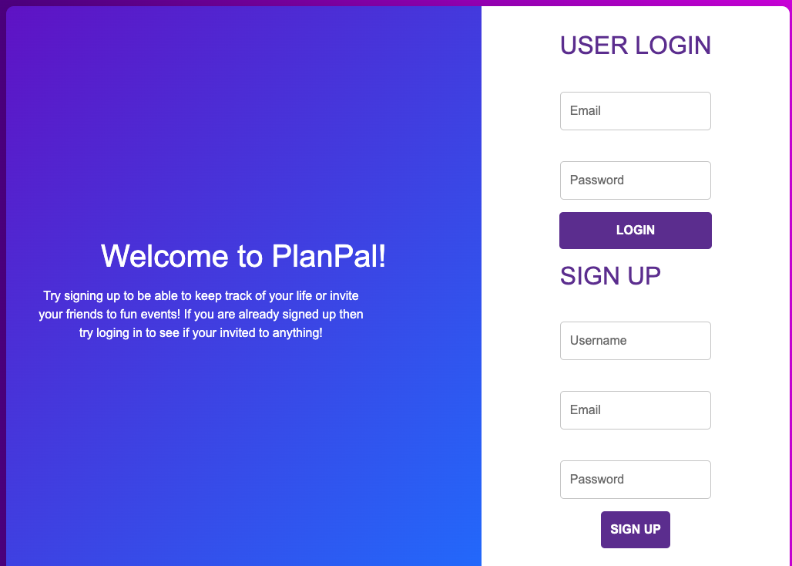
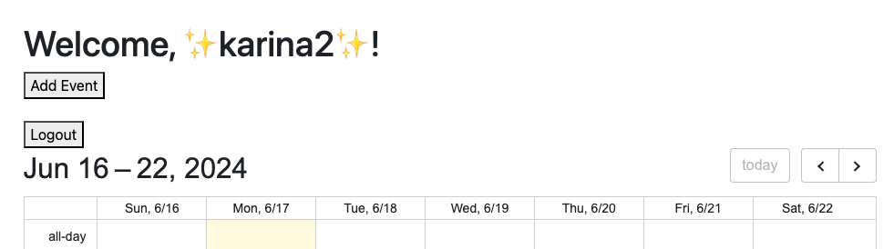

# PlanPal

## Description
PlanPal allows many users with the ablility to plan activities and events together. It can also be used as a Personal Planning application.

## Table of Contents
1. [Installation](#installation)
2. [Usage](#usage)
3. [License](#license)
4. [Contributing](#contributing)
5. [Tests](#tests)
6. [Questions](#questions)
7. [Acknowledgements](#acknowledgements)

## Installation
1. NPM install
A. @event-calendar/build
B. @event-calendar/core
C. @event-calendar/day-grid
2. DayJS
3. dotenv
4. Express
5. SQL
6. BCrypt
7. Postgres
8. Handlebars

## Usage
Users will find our application to be very useful! Once logged in, you're instantly directed to a sleek, intuitive calendar interface where you can effortlessly create and manage events. Whether it's planning meetings, social gatherings, or personal reminders, PlanPal makes it simple to stay organized and on top of your schedule. Say goodbye to missed appointments and double bookings. PlanPal is your go-to solution for efficient and effective time management. Simplify your life, one event at a time.

Github Repo:  https://github.com/BradBurr-Github/PlanPal
Render Deployed Link: https://planpal-yz2w.onrender.com/

## License
This project is not currently licensed.

## Contributing
Please email us to contribute.

## Tests
npm run test

## Questions
If you have any questions about this Project or its Repository, I can be reached at <a href=mailto:support@planpal.com>support@planpal.com</a>.  You can also find more of my work at <a href=https://github.com/BradBurr-Github/PlanPal>PlanPal</a>.

## Acknowledgements
None at this time.